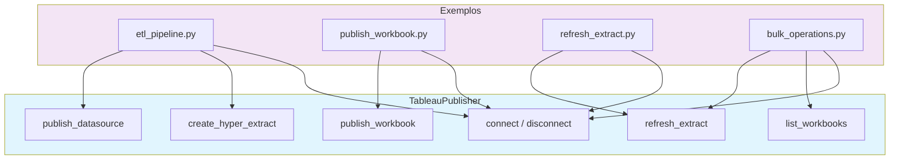

# Tableau Python Automated Dashboard Generator

Framework de demonstracao para automacao de operacoes do Tableau Server usando Python. Implementa o padrao de API do Tableau Server com metodos stub — projetado como referencia de arquitetura, nao como integracao funcional.

Demonstration framework for Tableau Server operations automation using Python. Implements the Tableau Server API pattern with stub methods — designed as an architecture reference, not a working integration.

[](https://python.org)
[](https://pandas.pydata.org)
[](LICENSE)

[Portugues](#portugues) | [English](#english)

---

## Portugues

### Visao Geral

Este repositorio contem um **framework de demonstracao** que simula operacoes do Tableau Server. A classe `TableauPublisher` define a interface para publicacao de workbooks, datasources, criacao de extracts e refresh — mas **todos os metodos sao stubs** que imprimem mensagens e retornam dados mockados.

> **Nota importante**: Nenhuma conexao real com o Tableau Server e estabelecida. O metodo `create_hyper_extract()` salva um arquivo CSV (nao um `.hyper` real). Para integracao real, use [`tableauserverclient`](https://tableau.github.io/server-client-python/) e [`pantab`](https://pantab.readthedocs.io/).

### Arquitetura



### Funcionalidades (Stub/Demonstracao)

| Metodo | O que faz na pratica |
|--------|---------------------|
| `connect()` | Define `self.connected = True` e imprime mensagem |
| `disconnect()` | Define `self.connected = False` |
| `create_hyper_extract()` | Salva DataFrame como CSV (nao cria `.hyper`) |
| `publish_workbook()` | Retorna dict com timestamp (nao publica nada) |
| `publish_datasource()` | Retorna dict com timestamp (nao publica nada) |
| `refresh_extract()` | Retorna `{"status": "pending"}` (nao faz refresh) |
| `list_workbooks()` | Retorna 2 workbooks hardcoded (mock) |

### Inicio Rapido

```bash
# Clonar o repositorio
git clone https://github.com/galafis/tableau-python-automated-dashboard-generator.git
cd tableau-python-automated-dashboard-generator

# Criar e ativar ambiente virtual
python -m venv venv
source venv/bin/activate  # Windows: venv\Scripts\activate

# Instalar dependencias
pip install -r requirements.txt

# Executar o pipeline de exemplo
python src/tableau_automation/tableau_publisher.py

# Executar o exemplo de ETL
python examples/etl_pipeline.py
```

### Testes

```bash
# Executar todos os testes
pytest

# Com cobertura
pytest --cov=src --cov-report=term-missing
```

### Estrutura do Projeto

```
tableau-python-automated-dashboard-generator/
├── src/
│   ├── __init__.py
│   └── tableau_automation/
│       ├── __init__.py
│       └── tableau_publisher.py    # Classe TableauPublisher (stub)
├── examples/
│   ├── etl_pipeline.py             # ETL: gerar dados + salvar CSV + publicar (mock)
│   ├── publish_workbook.py         # Publicar workbook (mock)
│   ├── refresh_extract.py          # Refresh de extract (mock)
│   └── bulk_operations.py          # Operacoes em lote (mock)
├── tests/
│   ├── __init__.py
│   └── test_tableau_publisher.py   # 18 testes unitarios
├── requirements.txt
├── pyproject.toml
├── setup.py
├── setup.cfg
└── LICENSE
```

### Stack Tecnologica

| Tecnologia | Uso real |
|------------|----------|
| **Python** | Linguagem principal |
| **Pandas** | Criacao de DataFrames e exportacao CSV |
| **NumPy** | Geracao de dados aleatorios nos exemplos |
| **pytest** | Framework de testes |

---

## English

### Overview

This repository contains a **demonstration framework** that simulates Tableau Server operations. The `TableauPublisher` class defines the interface for publishing workbooks, datasources, creating extracts, and refreshing — but **all methods are stubs** that print messages and return mock data.

> **Important note**: No actual connection to Tableau Server is established. The `create_hyper_extract()` method saves a CSV file (not a real `.hyper`). For real integration, use [`tableauserverclient`](https://tableau.github.io/server-client-python/) and [`pantab`](https://pantab.readthedocs.io/).

### Architecture


### Features (Stub/Demonstration)

| Method | What it actually does |
|--------|----------------------|
| `connect()` | Sets `self.connected = True` and prints a message |
| `disconnect()` | Sets `self.connected = False` |
| `create_hyper_extract()` | Saves DataFrame as CSV (does not create `.hyper`) |
| `publish_workbook()` | Returns dict with timestamp (does not publish) |
| `publish_datasource()` | Returns dict with timestamp (does not publish) |
| `refresh_extract()` | Returns `{"status": "pending"}` (no actual refresh) |
| `list_workbooks()` | Returns 2 hardcoded mock workbooks |

### Quick Start

```bash
# Clone the repository
git clone https://github.com/galafis/tableau-python-automated-dashboard-generator.git
cd tableau-python-automated-dashboard-generator

# Create and activate virtual environment
python -m venv venv
source venv/bin/activate  # Windows: venv\Scripts\activate

# Install dependencies
pip install -r requirements.txt

# Run the example pipeline
python src/tableau_automation/tableau_publisher.py

# Run the ETL example
python examples/etl_pipeline.py
```

### Testing

```bash
# Run all tests
pytest

# With coverage
pytest --cov=src --cov-report=term-missing
```

### Project Structure

```
tableau-python-automated-dashboard-generator/
├── src/
│   ├── __init__.py
│   └── tableau_automation/
│       ├── __init__.py
│       └── tableau_publisher.py    # TableauPublisher class (stub)
├── examples/
│   ├── etl_pipeline.py             # ETL: generate data + save CSV + publish (mock)
│   ├── publish_workbook.py         # Publish workbook (mock)
│   ├── refresh_extract.py          # Refresh extract (mock)
│   └── bulk_operations.py          # Bulk operations (mock)
├── tests/
│   ├── __init__.py
│   └── test_tableau_publisher.py   # 18 unit tests
├── requirements.txt
├── pyproject.toml
├── setup.py
├── setup.cfg
└── LICENSE
```

### Tech Stack

| Technology | Actual usage |
|------------|-------------|
| **Python** | Core language |
| **Pandas** | DataFrame creation and CSV export |
| **NumPy** | Random data generation in examples |
| **pytest** | Testing framework |

---

### Author / Autor

**Gabriel Demetrios Lafis**
- GitHub: [@galafis](https://github.com/galafis)
- LinkedIn: [Gabriel Demetrios Lafis](https://linkedin.com/in/gabriel-demetrios-lafis)

### License / Licenca

MIT License - see [LICENSE](LICENSE) for details.
