# 📊 Tableau Python Automated Dashboard Generator

> Automated dashboard generation tool combining Tableau and Python. Creates interactive visualizations, scheduled reports, and data-driven dashboards programmatically.

[](https://img.shields.io/badge/)
[](https://img.shields.io/badge/)
[](https://img.shields.io/badge/)
[](LICENSE)

[English](#english) | [Português](#português)

---

## English

### 🎯 Overview

**Tableau Python Automated Dashboard Generator** is a production-grade Python application that showcases modern software engineering practices including clean architecture, comprehensive testing, containerized deployment, and CI/CD readiness.

The codebase comprises **1,006 lines** of source code organized across **10 modules**, following industry best practices for maintainability, scalability, and code quality.

### ✨ Key Features

- **📊 Interactive Visualizations**: Dynamic charts with real-time data updates
- **🎨 Responsive Design**: Adaptive layout for desktop and mobile devices
- **📈 Data Aggregation**: Multi-dimensional data analysis and filtering
- **📥 Export Capabilities**: PDF, CSV, and image export for reports
- **🏗️ Object-Oriented**: 2 core classes with clean architecture

### 🏗️ Architecture

```mermaid
graph TB
    subgraph Core["🏗️ Core"]
        A[Main Module]
        B[Business Logic]
        C[Data Processing]
    end
    
    subgraph Support["🔧 Support"]
        D[Configuration]
        E[Utilities]
        F[Tests]
    end
    
    A --> B --> C
    D --> A
    E --> B
    F -.-> B
    
    style Core fill:#e1f5fe
    style Support fill:#f3e5f5
```



### 🚀 Quick Start

#### Prerequisites

- Python 3.12+
- pip (Python package manager)

#### Installation

```bash
# Clone the repository
git clone https://github.com/galafis/tableau-python-automated-dashboard-generator.git
cd tableau-python-automated-dashboard-generator

# Create and activate virtual environment
python -m venv venv
source venv/bin/activate  # On Windows: venv\Scripts\activate

# Install dependencies
pip install -r requirements.txt
```

#### Running

```bash
# Run the application
python src/main.py
```

### 🧪 Testing

```bash
# Run all tests
pytest

# Run with coverage report
pytest --cov --cov-report=html

# Run specific test module
pytest tests/test_main.py -v

# Run with detailed output
pytest -v --tb=short
```

### 📁 Project Structure

```
tableau-python-automated-dashboard-generator/
├── config/        # Configuration
│   └── tableau_config.example.yaml
├── examples/
│   ├── bulk_operations.py
│   ├── etl_pipeline.py
│   ├── publish_workbook.py
│   └── refresh_extract.py
├── images/
├── src/          # Source code
│   ├── tableau_automation/
│   │   ├── __init__.py
│   │   └── tableau_publisher.py
│   └── __init__.py
├── tests/         # Test suite
│   ├── __init__.py
│   └── test_tableau_publisher.py
├── CONTRIBUTING.md
├── LICENSE
├── README.md
├── pyproject.toml
├── requirements.txt
├── setup.cfg
└── setup.py
```

### 🛠️ Tech Stack

| Technology | Description | Role |
|------------|-------------|------|
| **Python** | Core Language | Primary |
| **NumPy** | Numerical computing | Framework |
| **Pandas** | Data manipulation library | Framework |

### 🤝 Contributing

Contributions are welcome! Please feel free to submit a Pull Request. For major changes, please open an issue first to discuss what you would like to change.

1. Fork the project
2. Create your feature branch (`git checkout -b feature/AmazingFeature`)
3. Commit your changes (`git commit -m 'Add some AmazingFeature'`)
4. Push to the branch (`git push origin feature/AmazingFeature`)
5. Open a Pull Request

### 📄 License

This project is licensed under the MIT License - see the [LICENSE](LICENSE) file for details.

### 👤 Author

**Gabriel Demetrios Lafis**
- GitHub: [@galafis](https://github.com/galafis)
- LinkedIn: [Gabriel Demetrios Lafis](https://linkedin.com/in/gabriel-demetrios-lafis)

---

## Português

### 🎯 Visão Geral

**Tableau Python Automated Dashboard Generator** é uma aplicação Python de nível profissional que demonstra práticas modernas de engenharia de software, incluindo arquitetura limpa, testes abrangentes, implantação containerizada e prontidão para CI/CD.

A base de código compreende **1,006 linhas** de código-fonte organizadas em **10 módulos**, seguindo as melhores práticas do setor para manutenibilidade, escalabilidade e qualidade de código.

### ✨ Funcionalidades Principais

- **📊 Interactive Visualizations**: Dynamic charts with real-time data updates
- **🎨 Responsive Design**: Adaptive layout for desktop and mobile devices
- **📈 Data Aggregation**: Multi-dimensional data analysis and filtering
- **📥 Export Capabilities**: PDF, CSV, and image export for reports
- **🏗️ Object-Oriented**: 2 core classes with clean architecture

### 🏗️ Arquitetura


### 🚀 Início Rápido

#### Prerequisites

- Python 3.12+
- pip (Python package manager)

#### Installation

```bash
# Clone the repository
git clone https://github.com/galafis/tableau-python-automated-dashboard-generator.git
cd tableau-python-automated-dashboard-generator

# Create and activate virtual environment
python -m venv venv
source venv/bin/activate  # On Windows: venv\Scripts\activate

# Install dependencies
pip install -r requirements.txt
```

#### Running

```bash
# Run the application
python src/main.py
```

### 🧪 Testing

```bash
# Run all tests
pytest

# Run with coverage report
pytest --cov --cov-report=html

# Run specific test module
pytest tests/test_main.py -v

# Run with detailed output
pytest -v --tb=short
```

### 📁 Estrutura do Projeto

```
tableau-python-automated-dashboard-generator/
├── config/        # Configuration
│   └── tableau_config.example.yaml
├── examples/
│   ├── bulk_operations.py
│   ├── etl_pipeline.py
│   ├── publish_workbook.py
│   └── refresh_extract.py
├── images/
├── src/          # Source code
│   ├── tableau_automation/
│   │   ├── __init__.py
│   │   └── tableau_publisher.py
│   └── __init__.py
├── tests/         # Test suite
│   ├── __init__.py
│   └── test_tableau_publisher.py
├── CONTRIBUTING.md
├── LICENSE
├── README.md
├── pyproject.toml
├── requirements.txt
├── setup.cfg
└── setup.py
```

### 🛠️ Stack Tecnológica

| Tecnologia | Descrição | Papel |
|------------|-----------|-------|
| **Python** | Core Language | Primary |
| **NumPy** | Numerical computing | Framework |
| **Pandas** | Data manipulation library | Framework |

### 🤝 Contribuindo

Contribuições são bem-vindas! Sinta-se à vontade para enviar um Pull Request.

### 📄 Licença

Este projeto está licenciado sob a Licença MIT - veja o arquivo [LICENSE](LICENSE) para detalhes.

### 👤 Autor

**Gabriel Demetrios Lafis**
- GitHub: [@galafis](https://github.com/galafis)
- LinkedIn: [Gabriel Demetrios Lafis](https://linkedin.com/in/gabriel-demetrios-lafis)
